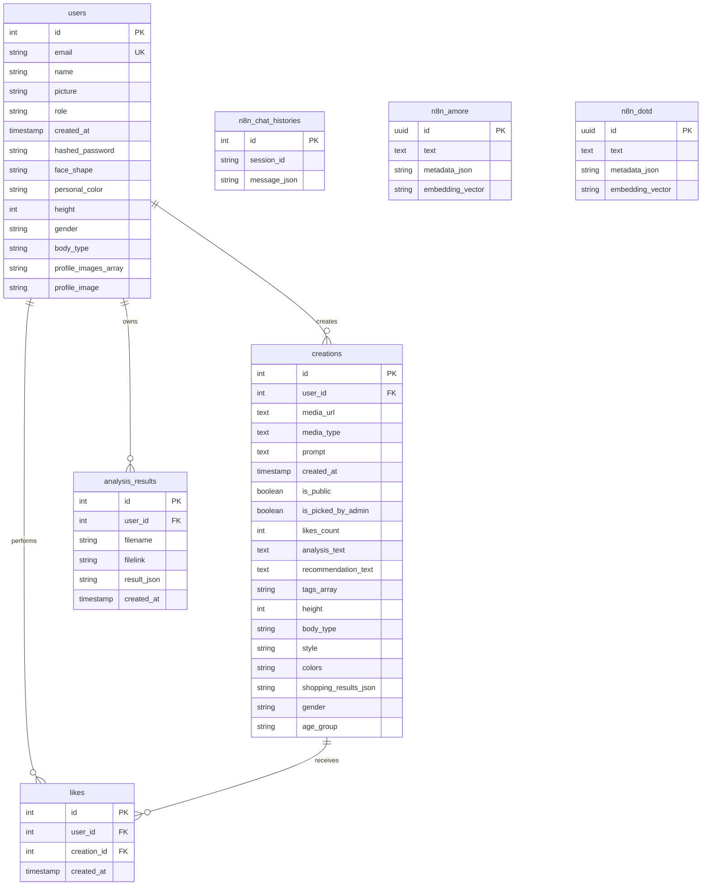

# Entity Relationship Diagram (ERD)

This diagram represents the data model for the DOTD application based on the PostgreSQL schema.

## Table Descriptions

*   **users**: Stores user account information.
*   **creations**: Stores the generated OOTD images and metadata.
*   **likes**: Stores user likes on creations.
*   **analysis_results**: Logs analysis history.
*   **n8n_chat_histories**: Stores chat session data.
*   **n8n_amore / n8n_dotd**: Vector stores.