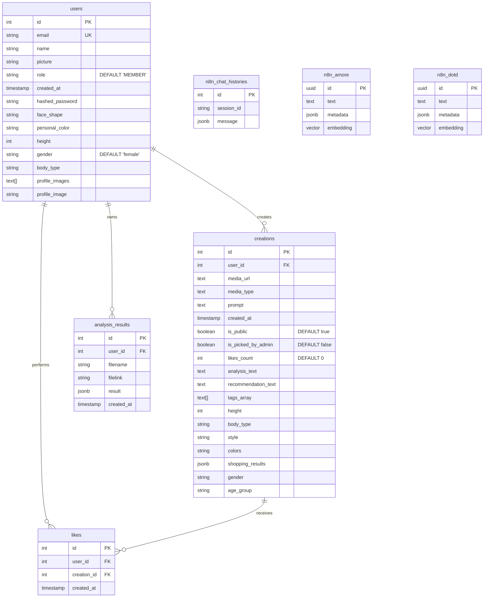

# Entity Relationship Diagram (ERD)

This diagram represents the data model for the DOTD application based on the PostgreSQL schema.

## Table Descriptions

*   **users**: Stores user account information, including profile details like body type, face shape, and personal color used for styling.
*   **creations**: Stores the generated OOTD images, prompts, AI analysis results, and shopping recommendations.
*   **likes**: Junction table for storing user likes on creations to support the community feed features.
*   **analysis_results**: Logs history of file analyses performed by users.
*   **n8n_chat_histories**: Stores chat session data for the chatbot feature powered by n8n.
*   **n8n_amore / n8n_dotd**: Vector stores for RAG (Retrieval-Augmented Generation) or similarity search features.
