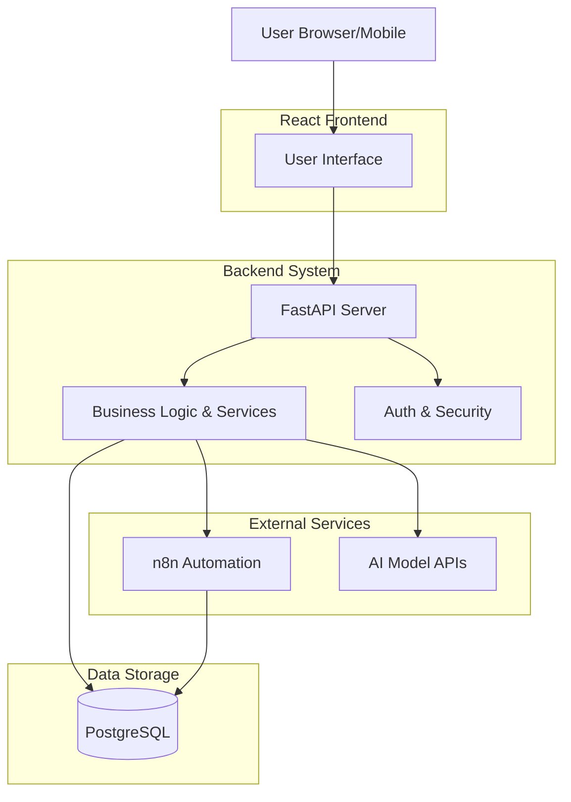

# System Architecture

The following diagram illustrates the high-level architecture of the DOTD (Outfit of the Day) application.

## Key Components

1.  **Frontend (React + Vite)**: SPA handling UI and user interactions.
2.  **Backend (FastAPI)**: REST API server managing logic, auth, and integrations.
3.  **Database (PostgreSQL)**: Stores user data and creations.
4.  **n8n**: Workflow automation service.
5.  **AI Services**: External APIs for generation and analysis.