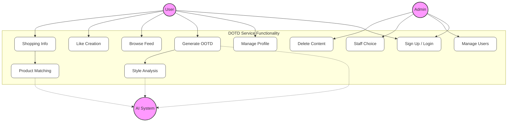

# Use Case Diagram (Flowchart Style)

This diagram outlines the primary interactions users and admins have with the DOTD system, represented using a flowchart for maximum compatibility.

## Description

*   **User**: Can perform core actions like generating outfits, managing their profile, and interacting with the community feed.
*   **Admin**: Responsible for system maintenance, user management, and content moderation.
*   **AI System**: Represents the automated processes for image generation, style insights, and shopping product matching.
